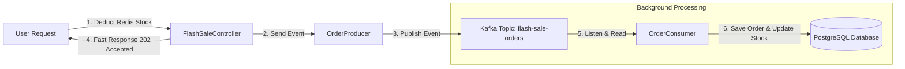

# 🚀 How Kafka Works in this Flash Sale Project (Made Simple!)

---

## 💡 1. The Real-Life Restaurant Metaphor

Imagine a super popular fast-food restaurant during a rush hour:

- **Without Kafka (The Chaos Model)**:
  1,000 hungry customers arrive all at once. The cashier takes an order, walks into the kitchen, waits for the chef to cook the burger, writes down the receipt on paper, and then hands the burger to the customer. 
  👉 **Result**: The cashier gets stuck waiting on the kitchen. The line freezes, customers get angry, and the kitchen crashes!

- **With Kafka (The Smart Model)**:
  1. The Cashier takes the order, prints a token slip, and drops it into a **fast-moving conveyor belt (Kafka)**.
  2. The Cashier immediately hands you your token number (`202 Accepted`) and moves to the next customer in **1 millisecond**.
  3. The **Chefs in the kitchen (Kafka Consumers)** pick up tokens from the conveyor belt one-by-one at their own safe pace and cook the food.

---

## ❓ 2. Why do we need Kafka here?

In a Flash Sale, **5,000 users** click "BUY NOW" at the exact same second.

Writing directly to PostgreSQL takes ~50–100 milliseconds per transaction. PostgreSQL can only handle a limited number of disk writes per second. If 5,000 requests hit PostgreSQL simultaneously, the database freezes.

**Kafka acts as a Traffic Shock Absorber!**
- It accepts thousands of order messages per second instantly in memory.
- It holds them safely in a queue.
- It lets our PostgreSQL database save them quietly in the background without crashing.

---

## 🔄 3. Step-by-Step Kafka Flow in Code



### Step 1: The Producer sends the message
When Redis confirms stock is available, [`OrderProducer.java`](file:///home/ved/IdeaProjects/FlashSaleTest/src/main/java/com/dev/FlashSale/service/OrderProducer.java) creates an `OrderPlacedEvent` and drops it into Kafka:

```java
// OrderProducer.java
public void sendOrderEvent(OrderPlacedEvent event) {
    // Sends message to topic "flash-sale-orders"
    kafkaTemplate.send("flash-sale-orders", String.valueOf(event.itemId()), event);
}
```

### Step 2: The User gets a fast response
The Web Controller immediately returns a success message to the user (`202 ACCEPTED`), without waiting for PostgreSQL:

```java
// FlashSaleController.java
orderProducer.sendOrderEvent(event);
return ResponseEntity.status(HttpStatus.ACCEPTED)
        .body("Order accepted! Processing ID: " + orderId);
```

### Step 3: The Consumer processes the queue in the background
In the background, [`OrderConsumer.java`](file:///home/ved/IdeaProjects/FlashSaleTest/src/main/java/com/dev/FlashSale/service/OrderConsumer.java) reads messages off the Kafka topic one by one and writes them to PostgreSQL:

```java
// OrderConsumer.java
@KafkaListener(topics = "flash-sale-orders", groupId = "flash-sale-group")
@Transactional
public void processOrder(OrderPlacedEvent event) {
    // 1. Save order receipt to PostgreSQL database
    orderRepository.save(new OrderRecord(event.userId(), event.itemId()));

    // 2. Reduce official inventory count in PostgreSQL database
    Item item = itemRepository.findById(event.itemId()).get();
    item.setStock(item.getStock() - 1);
    itemRepository.save(item);
}
```

---

## 🧩 4. Understanding Topic Config (`KafkaTopicConfig.java`)

In your project, you have a configuration file called [`KafkaTopicConfig.java`](file:///home/ved/IdeaProjects/FlashSaleTest/src/main/java/com/dev/FlashSale/config/KafkaTopicConfig.java) with this code:

```java
@Configuration
public class KafkaTopicConfig {

    @Bean
    public NewTopic flashSaleOrdersTopic() {
        return TopicBuilder.name("flash-sale-orders")
                .partitions(3)
                .replicas(1)
                .build();
    }
}
```

Here is **exactly** what each part does in easy language:

### Line 1: `TopicBuilder.name("flash-sale-orders")`
- **What it means**: This sets the name of the topic (queue).
- **Metaphor**: Naming a mailbox `"flash-sale-orders"`. All producers write to this mailbox name, and all consumers read from this mailbox name.

---

### Line 2: `.partitions(3)` (The 3-Lane Highway)
- **What is a Partition?**:
  Imagine a 1-lane road. If 1,000 cars drive on a 1-lane road, they must drive one behind another. If car #1 slows down, everyone stops.
  If you widen the road into a **3-Lane Highway (3 Partitions)**, 3 cars can drive side-by-side at the **exact same time**!

- **In Kafka**:
  - A Topic is divided into smaller sub-queues called **Partitions**.
  - Setting `.partitions(3)` splits `"flash-sale-orders"` into **3 parallel sub-queues** (Partition 0, Partition 1, Partition 2).
  - This allows up to **3 Consumer threads/servers** to read and process orders simultaneously in parallel!

- **How do orders choose which partition to go into? (Partition Key)**
  In [`OrderProducer.java`](file:///home/ved/IdeaProjects/FlashSaleTest/src/main/java/com/dev/FlashSale/service/OrderProducer.java), we wrote:
  ```java
  kafkaTemplate.send("flash-sale-orders", String.valueOf(event.itemId()), event);
  ```
  The second parameter `String.valueOf(event.itemId())` is the **Partition Key**.
  Kafka takes `itemId` (e.g. Item `#1`), calculates a hash code, and assigns all orders for Item `#1` to **Partition 0**.
  - All orders for **Item #1** go to **Partition 0** (guaranteeing exact order for Item #1).
  - All orders for **Item #2** go to **Partition 1**.
  - All orders for **Item #3** go to **Partition 2**.
  
  👉 **Benefit**: Perfect sequence per item + 3x parallel speed!


Multiple items can share the same partition lane.
Crucial Rule: All orders for Item #1 will ALWAYS go to Partition 1.
This guarantees that orders for Item #1 are saved to PostgreSQL in the exact sequence they arrived.
You set partition count based on CPU cores / Consumer worker threads, not product catalog size!


> ⚠️ **Common Misconception: "If I have 10 items to sell, do I need 10 partitions?"**  
> **NO!** The number of partitions does **NOT** depend on the number of items or stock quantity.  
> - **Item Count / Stock**: Inventory data stored in Redis (e.g. 10 items or 10,000 items).  
> - **Kafka Partitions**: Infrastructure processing lanes (e.g. 3 partitions).  
> 
> **How 100 items fit into 3 Partitions**:  
> Kafka uses a hashing formula (`hash(itemId) % 3`). If you have 10 products:  
> - **Partition 0** handles Items `#3, #6, #9`  
> - **Partition 1** handles Items `#1, #4, #7, #10`  
> - **Partition 2** handles Items `#2, #5, #8`  
> 
> Multiple products share the same partition lane. But **all orders for Item #1 ALWAYS stay in Partition 1**, preserving strict order sequence for that product!

---

### Line 3: `.replicas(1)` (The Backup Copier)
- **What is a Replica?**:
  A **Replica** is a backup copy of your data stored on another Kafka server (broker).
  - If `replicas(3)`, Kafka keeps 1 main copy and 2 backup copies on 3 different physical servers. If Server A crashes, Server B immediately takes over without losing a single order.
  - Setting `.replicas(1)` means: **"Keep 1 copy of the data (no extra backup servers)"**.

- **Why did we set `replicas(1)` here?**:
  Because in our local setup (`docker-compose.yml`), we are running **1 single Kafka server container** on our laptop. A single server can only hold 1 copy of itself! In production with a cluster of 3 Kafka servers, you would set `replicas(3)`.

---

## 📚 5. Summary of Key Kafka Terms

| Kafka Term | Simple Analogy | What it is in this Project |
| :--- | :--- | :--- |
| **Topic** | Mailbox / Channel name | `"flash-sale-orders"` |
| **Partition** | Parallel driving lanes in a highway | `3` partitions for 3x throughput |
| **Replica** | Backup copy of data | `1` copy (local Docker server) |
| **Producer** | The cashier putting tokens on the belt | [`OrderProducer.java`](file:///home/ved/IdeaProjects/FlashSaleTest/src/main/java/com/dev/FlashSale/service/OrderProducer.java) |
| **Consumer** | Chef taking tokens off the belt | [`OrderConsumer.java`](file:///home/ved/IdeaProjects/FlashSaleTest/src/main/java/com/dev/FlashSale/service/OrderConsumer.java) |
| **Consumer Group** | Team of chefs sharing the work | `"flash-sale-group"` |
| **Partition Key** | Route token by product type | `itemId` (keeps item sequence) |

---

## 🎯 Final Takeaway

1. **Redis**: Validates and deducts stock in memory instantly (**< 2 ms**) to block overselling.
2. **Kafka Producer**: Pushes the order into 1 of 3 parallel topic partitions using `itemId` key (**< 3 ms**).
3. **Kafka Topic Config**: Creates topic `"flash-sale-orders"` with **3 Partitions** (for 3x parallel speed) and **1 Replica** (local copy).
4. **Kafka Consumer**: Reads order messages from the partitions safely in the background and saves them to PostgreSQL without database overload!
