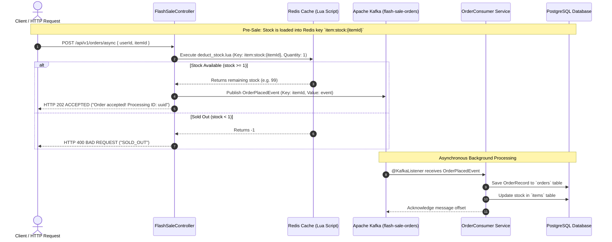

# Flash Sale High-Concurrency System — Project Documentation

## 1. Executive Summary & Architecture Overview

This project is a high-concurrency **Flash Sale System** (e-commerce limited-stock rush sale system) designed to handle extreme traffic surges (e.g., thousands of orders per second for limited inventory items) without database lock contention, race conditions, or overselling.

### The Challenge of Flash Sales
In traditional web applications, placing an order directly executes SQL statements like:
```sql
SELECT stock FROM items WHERE id = 1;
UPDATE items SET stock = stock - 1 WHERE id = 1;
INSERT INTO orders (user_id, item_id) VALUES (...);
```
Under flash sale traffic:
1. **Overselling (Race Condition)**: Concurrent requests read positive stock simultaneously, resulting in negative inventory (selling more items than available).
2. **Database Bottlenecks**: Row locks in relational databases cause severe CPU spikes, thread pool exhaustion, latency spikes, and server crashes.

### The Architecture Solution
This project solves high concurrency using a 3-tier decoupled architecture:
1. **In-Memory Atomic Inventory Control (Redis + Lua)**: Fast stock validation & atomic deduction (<2ms latency) directly in Redis memory using Lua scripts, guaranteeing zero overselling.
2. **Asynchronous Event Stream (Kafka)**: Decoupling request ingestion from disk writes. Orders are published to a distributed message broker instantly.
3. **Eventual Consistency Persistence (PostgreSQL Consumer)**: Background workers consume Kafka order messages at a controlled write rate, persisting transactions safely to PostgreSQL.

---

## 2. System Architecture & Flow Diagram



---

## 3. Technology Stack & Component Analysis

| Layer | Technology | Purpose in System |
| :--- | :--- | :--- |
| **Framework** | Spring Boot 3.3.x (Java 17+) | Core REST controllers, dependency injection, JPA, Spring Kafka, Spring Data Redis |
| **In-Memory Cache** | Redis 7 (Alpine) | Ultra-fast in-memory inventory management & atomic Lua script execution |
| **Message Broker** | Apache Kafka 7.5.0 (KRaft Mode) | Asynchronous buffer to decouple high API throughput from database write limits |
| **Database** | PostgreSQL 15 (Alpine) | Persistent storage for historical orders and canonical item inventory records |
| **Containerization** | Docker Compose | Local orchestration for PostgreSQL, Redis, and Kafka |

---

## 4. In-Depth: Redis & Lua Script Implementation

### Why Redis?
Redis operates in-memory with sub-millisecond read/write performance. Because single-threaded event processing in Redis executes operations sequentially, it is ideal for race-free counters when combined with Lua scripts.

### The Atomic Stock Deduction Flow
When an order request hits [`RedisInventoryService.java`](file:///home/ved/IdeaProjects/FlashSaleTest/src/main/java/com/dev/FlashSale/service/RedisInventoryService.java), Spring Data Redis executes the atomic Lua script [`deduct_stock.lua`](file:///home/ved/IdeaProjects/FlashSaleTest/src/main/resources/scripts/deduct_stock.lua):

#### Lua Script Code (`src/main/resources/scripts/deduct_stock.lua`):
```lua
local stockKey = KEYS[1]
local requestedQuantity = tonumber(ARGV[1])

local currentStock = tonumber(redis.call('GET', stockKey))

if not currentStock or currentStock < requestedQuantity then
    return -1
else
    return redis.call('DECRBY', stockKey, requestedQuantity)
end
```

#### How it Works:
1. **Single-Threaded Atomicity**: Redis executes Lua scripts as an atomic unit. No other command or client script can interrupt execution while the script runs.
2. **Stock Verification**: The script retrieves current stock for `item:stock:<itemId>`. If the key does not exist or `currentStock < requestedQuantity`, it returns `-1` (indicating `SOLD_OUT`).
3. **Atomic Deduction**: If sufficient stock exists, `redis.call('DECRBY', stockKey, requestedQuantity)` decrements the stock in Redis memory and returns the remaining count.
4. **Result**: Zero overselling guaranteed without using pessimistic DB locking or distributed locks.

---

## 5. In-Depth: Apache Kafka Producer & Consumer Flow

### Why Kafka?
If every HTTP request synchronously performed database writes, PostgreSQL would quickly become overwhelmed by thousands of concurrent write transactions. Kafka acts as a **traffic shock absorber (write buffer)**.

### Kafka Topic Architecture (`KafkaTopicConfig.java`)
- **Topic Name**: `flash-sale-orders`
- **Partitions**: `3`
- **Replication Factor**: `1`

### 1. Producer Flow (`OrderProducer.java` & `FlashSaleController.java`)
```java
String orderId = UUID.randomUUID().toString();
OrderPlacedEvent event = new OrderPlacedEvent(request.userId(), request.itemId(), orderId);
kafkaTemplate.send("flash-sale-orders", String.valueOf(event.itemId()), event);
```
- **Partitioning Strategy**: `event.itemId()` is passed as the Kafka message partition key. This guarantees that all order events for a specific item route to the *same* Kafka partition, preserving message ordering per item.
- **Immediate Response**: The HTTP controller does not wait for database saving. It returns `202 ACCEPTED` to the user in less than **5 milliseconds total**.

### 2. Consumer Flow (`OrderConsumer.java`)
```java
@KafkaListener(topics = "flash-sale-orders", groupId = "flash-sale-group")
@Transactional
public void processOrder(OrderPlacedEvent event) {
    // 1. Save order to PostgreSQL
    OrderRecord order = new OrderRecord(event.userId(), event.itemId());
    orderRepository.save(order);

    // 2. Update canonical stock in DB
    Item item = itemRepository.findById(event.itemId()).orElseThrow(...);
    item.setStock(item.getStock() - 1);
    itemRepository.save(item);
}
```
- **Consumer Group**: `flash-sale-group` listens to messages across all topic partitions.
- **Transactional Consistency**: `@Transactional` ensures that both saving the [`OrderRecord`](file:///home/ved/IdeaProjects/FlashSaleTest/src/main/java/com/dev/FlashSale/entity/OrderRecord.java) and decrementing the [`Item`](file:///home/ved/IdeaProjects/FlashSaleTest/src/main/java/com/dev/FlashSale/entity/Item.java) database stock occur in a single atomic database transaction. If an error occurs, the offset is not committed and the event can be retried.

---

## 6. End-to-End Execution & Order Lifecycle

```
[ User Request ]
       │
       ▼
 [ POST /api/v1/orders/async ]
       │
       ▼
 ┌───────────────────────────────────────────────┐
 │ 1. Redis Stock Check & Deduction (Lua Script) │
 └───────────────────────────────────────────────┘
       │
       ├─────────────────────────┐
       ▼ (stock < 0)             ▼ (stock >= 0)
 [ Return 400 SOLD_OUT ]   [ Create OrderPlacedEvent ]
                                 │
                                 ▼
                     ┌──────────────────────────┐
                     │ 2. Publish to Kafka Topic│
                     │   "flash-sale-orders"    │
                     └──────────────────────────┘
                                 │
                                 ▼
                     [ Return 202 ACCEPTED ] ───► User gets rapid response
                                 │
                 (Asynchronous Event Buffer)
                                 │
                                 ▼
                     ┌──────────────────────────┐
                     │ 3. Kafka Listener Consumer│
                     │   (@KafkaListener)       │
                     └──────────────────────────┘
                                 │
                                 ▼
                     ┌──────────────────────────┐
                     │ 4. Transactional DB Write│
                     │    - Insert OrderRecord  │
                     │    - Decrement Item Stock│
                     └──────────────────────────┘
```

---

## 7. Project Structure

```
FlashSaleTest/
├── docker-compose.yml                  # PostgreSQL, Redis, and Kafka services
├── pom.xml                             # Spring Boot dependencies (Web, Data JPA, Redis, Kafka)
├── src/
│   ├── main/
│   │   ├── java/com/dev/FlashSale/
│   │   │   ├── FlashSaleApplication.java
│   │   │   ├── config/
│   │   │   │   ├── KafkaTopicConfig.java   # Topic configuration (3 partitions)
│   │   │   │   └── RedisConfig.java        # Redis script loader bean
│   │   │   ├── controller/
│   │   │   │   └── FlashSaleController.java# Flash sale API endpoints
│   │   │   ├── DTOs/
│   │   │   │   ├── OrderPlacedEvent.java   # Kafka event payload
│   │   │   │   └── OrderRequest.java       # HTTP request body DTO
│   │   │   ├── entity/
│   │   │   │   ├── Item.java               # Item database entity
│   │   │   │   └── OrderRecord.java        # Order database entity
│   │   │   ├── repo/
│   │   │   │   ├── ItemRepository.java     # Spring Data JPA Repo for Item
│   │   │   │   └── OrderRepository.java    # Spring Data JPA Repo for OrderRecord
│   │   │   └── service/
│   │   │       ├── OrderConsumer.java      # Kafka event consumer & DB listener
│   │   │       ├── OrderProducer.java      # Kafka event publisher
│   │   │       └── RedisInventoryService.java # Redis stock manager with Lua
│   │   └── resources/
│   │       ├── application.yml         # Connection parameters for Postgres, Redis, Kafka
│   │       └── scripts/
│   │           └── deduct_stock.lua    # Atomic Redis stock deduction script
```

---

## 8. Setup & Running Instructions

### Prerequisites
- Docker & Docker Compose
- Java 17+
- Maven

### Step 1: Start Infrastructure Services
Run Docker Compose to start PostgreSQL, Redis, and Kafka (KRaft mode):
```bash
docker-compose up -d
```

### Step 2: Pre-warm Stock in Redis
Before triggering flash sale requests, initialize item stock in Redis (e.g., set 100 units for item ID `1`):
```bash
redis-cli SET item:stock:1 100
```

### Step 3: Run the Application
```bash
./mvnw spring-boot:run
```

### Step 4: Test High-Concurrency Flash Sale Endpoint
Send an HTTP POST request to place an asynchronous order:
```bash
curl -X POST http://localhost:8080/api/v1/orders/async \
  -H "Content-Type: application/json" \
  -d '{"userId": 101, "itemId": 1}'
```

**Expected Response**:
- If stock is available: `HTTP 202 Accepted` -> `"Order accepted! Processing ID: <uuid>"`
- If stock is empty: `HTTP 400 Bad Request` -> `"SOLD_OUT"`
